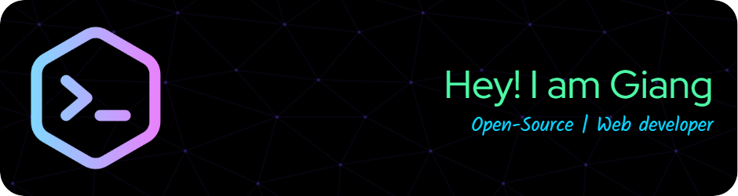

<h1 align="center">Hello, everyone! 👋 I'm Lê Huy Giang</h1>

  

- 🖥️ I'm a **Web Developer**
- 🌱 I'm an **enthusiast of open-source projects**
- 🔭 Currently, I'm expanding my knowledge in **Web Development**
- 💬 Feel free to ask me about **Node.js, Web Development, NPM**
- 📫 You can reach me at: **lehuygiang28@gmail.com**
- 📌 Visit my **[Website](https://giaang.id.vn)**
- 🤝 I'm always open to collaborations and contributions to my projects. Feel free to reach out or submit a pull request!

---

## 📈 GitHub Stats

<table width="100%" style="border:0px solid white;">
    <tr style="border:0px solid white;">
        <td width="50%" style="border:0px solid white;">
            
        </td>
        <td width="50%" style="border:0px solid white;">
            
        </td>
    </tr>
</table>

---

<table width="100%" style="border:0px solid white;">
    <tr style="border:0px solid white;">
        <td width="50%" valign="top" style="border:0px solid white;">
            
## 🛠️ Tech Stack

- 🌐 **Frontend**:     
- ⚙️ **Backend**:   
- 🛢️ **Database**:   
- 🗄️ **Version Control**:  
- 🚀 **Deployment**:   

    </td>
    <td width="50%" valign="top" style="border:0px solid white;">

## 💻 Languages and Tools

        

</td>
</tr>
</table>

---
